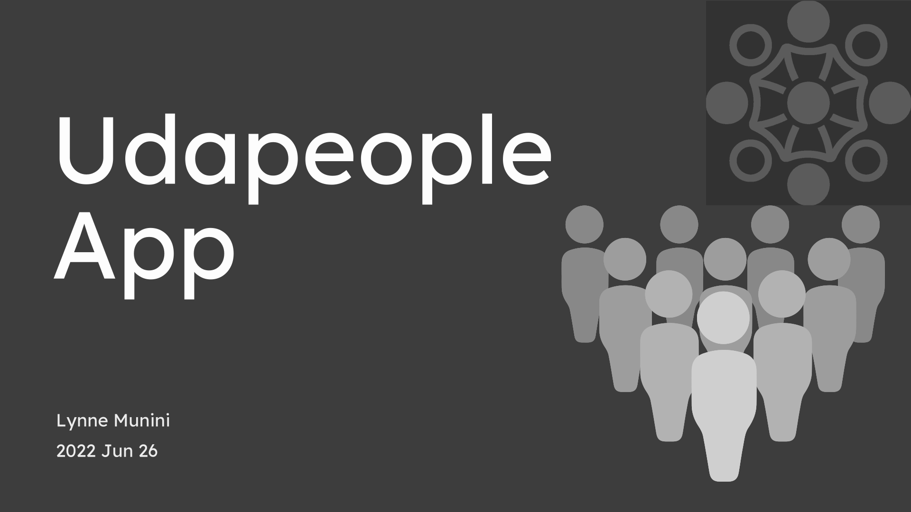

# Udapeople App

*Files in this repository:*

[Presentation](presentation.pdf)

Presentation in PDF format to explain to stakeholders the fundamentals and benefits of CI/CD to achieve, build, and deploy automation for cloud-based software products.

[Cloudformation Scripts](/.circleci/files)

The necessary CloudFormation templates that will be used throughout the deployment phase.

[Ansible Playbooks and Roles](/.circleci/ansible)

Directory that contains the Ansible playbooks and roles that will be used throughout the deployment phase. The playbooks and roles are used to deploy the application to AWS.

[CircleCI config.yml file](/.circleci/config.yml)

The CircleCI config.yml file that will use CI/CD to deploy the application to AWS. 

[The backend](backend)

This directory contains the files for the backend of the application.

[The frontend](frontend)

This directory contains the files for the frontend of the application.